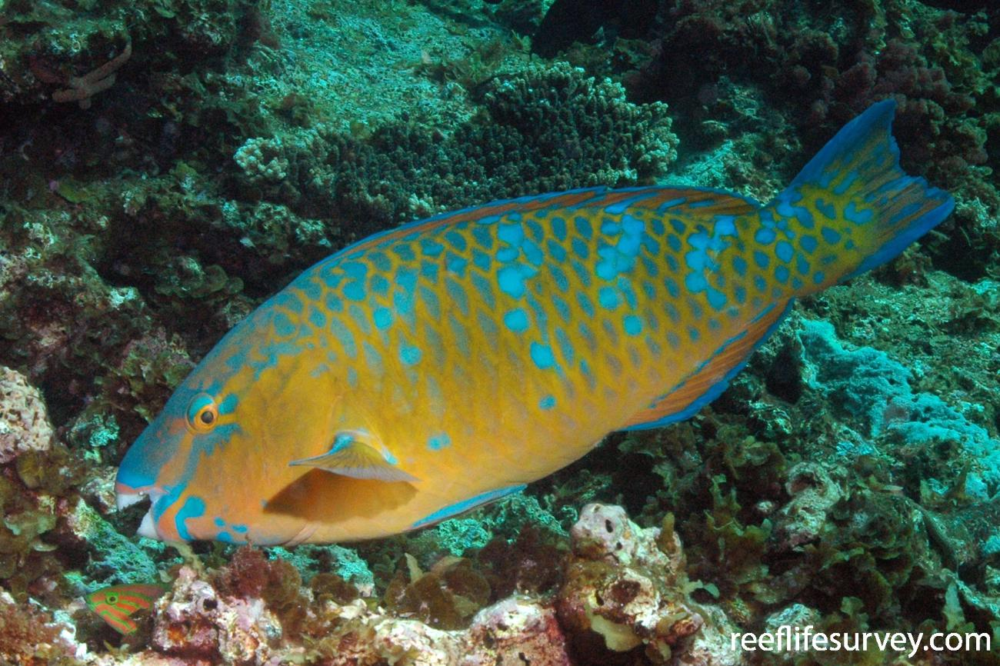

```{r setup, include=FALSE}
knitr::opts_chunk$set(echo = TRUE, warning = FALSE, message = FALSE)
```

# Cleaning ecological survey data for conservation scientists

The most time-consuming step in many analyses is the cleaning and preparation of the data. This course will show you how you can use R to speed up that process and make it more transparent and repeatable. This means it will also be easier to check for and correct errors in your data processing. 

This course is part of a new initiative [Conservation Hackers](https://www.conservationhackers.org/). Conservation hackers aims to connect conservation practitioners who need help with programming, data and data analysis with data scientists. Conservation hackers also aims to educate conservation scientists in programming skills. 

We're pleased to be partnering with [Reef Life Survey](https://reeflifesurvey.com/) to offer this course. Reef Life Survey is a not-for-profit organisation that trains volunteer citizen scientist divers in monitoring reef life. The Reef Life Survey data is freely available from their webpage and we'll be using it as an example of conservation monitoring data in this course. 

The course should take about 3 hours to complete. We'll focus on a particular set of packages for data analysis from the 'tidyverse'. We'll cover filtering, error checking, joining data frames and some simple plots. The course aims to to explain some key concepts in detail so that students have the confidence to learn more. 



## Setup for this course  

So that the course runs efficiently, and to save plenty of time for trying fun things in R, we'd ask that you come to the course prepared. 

Please [download these data files](https://github.com/cbrown5/RLS-data-prep-course/blob/master/data-raw/data-raw.zip), unzip them and put them in a folder where you will keep your R course notes. 

This is an intermediate level course, so we'll assume you know how to install R and R packages. As a general guide to what we expect in terms of prior knowledge, we'll assume you can run R, load data and write basic calculations that you save in a script. We'll assume you know nothing about how to structure data, create plots or make data summaries. Even if you know about these topics, you may still find the course helpful if you are self-taught, because we'll cover the conceptual foundation of these topics. 

Please have R and Rstudio installed on your computer before starting. You'll want to save plenty of time for doing this, it can be tricky on some computers, especially if you do not have 'admin' permission on a work computer. You may need to call IT to get help. We obviously only offer limited help with such installation issues. 
The latest version of R is version 4. You are welcome to try this version. We are using 3.6.2 currently for writing this course, so there may be some minor differences. The reason we haven't updated yet is that a lot of the packages we use haven't been updated yet. 

You'll also need to install a few R packages. We're using `dplyr`, `readr`, `lubridate`, `ggplot2`, `tidyr`, and `patchwork` in this course. You can install them with this R code: 
`install.packages(c("dplyr", "readr", "lubridate", "ggplot2", "tidyr", "patchwork"))`. To install the first five packages in one go (plus more handy data wrangling packages we won't cover here) use `install.packages(c("tidyverse"))`.

If that doesn't work email us with the error and we'll try to help. Otherwise, see your IT department for help. 
We're using dplyr version 1.0, which was released earlier this year. If you have an older version of dplyr the course should still work fine, but there may be some minor differences in the code. 

## Data and the case-study

We will use data from Reef Life Survey's Rottnest Island surveys (accessible [here](https://reeflifesurvey.com/survey-data/)). Rottnest Island is in Western Australia and its reefs host a diverse fish assemblage. This includes both temperate and tropical species. In 2011 a heatwave caused the fish community to undergo a massive change. We'll base our analysis today on a study by [Day and colleagues](https://onlinelibrary.wiley.com/doi/full/10.1111/ddi.12753), which showed an increase in tropical fish during and after the heatwave. 

We'll aim to organize this data so we can study the effects of the heatwave on temperate and tropical species composition. 

We've modified the data slightly so it contains some errors to practice with, so if you want to use this data for real science, please contact Reef Life Survey directly. 

## Overview of R in RStudio

We'll assume you are using R in Rstudio. Rstudio is an integrated developmement environment or IDE in hacker speak. The Rstudio IDE is an interface to R that adds many human friendly features. There are a few terms we'll assume you are familiar with in this course. First Rstudio's window panes: 

- Console: where the code is evaluated (computed) by the R program. 
- Script: Where you write your code so you can save it for later
- Environment: Basically the data in R's memory
- Object: Data in R's memory, 'data' includes functions and all of R's algorithms. 
- Class: Object's have different types, which means they interact with you and functions in different ways. Common classes are numeric, strings, logicals, lists and data frames. 
- data frame: a class of R object commonly used for storing data, it has an equal number of rows, column names and columns can vary in the class of data they store (e.g. dates, words, numbers). 

Some other important terms you should know: 

- R Package: a collection of code tools that we can import to add functionality to the base R language. A package directory is its 'library' hence we read packages in with the `library()` command. 
- Function: a programming tool (AKA algorithm) that has been preprepared for use in R. 
- Arguments: The parameters that a function uses to decide what to do. 

To find out what a function does and the arguments it uses, use the help() function, or ?.

```{r}
help(library)
#?library
```

If you're having trouble using functions with your own data, the 'Examples' section in the help documentation can be a good place to start.

## The importance of being organized

So now you know Rstudio and have downloaded the data, let's talk about being organized. Organization is key, because even simple statistics can produce a lot of complex code and many intermediate data outputs. 

We recommend you create a folder on your computer for each new project, like today's course. You can do this as an Rstudio project if you like (see File > New project) or just as a folder. Within that create a data-raw folder where you will keep your raw data. If datafiles are really big, then you might also have a folder somewhere else (e.g. on the drive) that you link to later. You can store intermediate data-steps in data-raw or another folder, it's up to you. Also make a folder for your R code and a folder to save your figures in. 

We also recommend giving your files human and machine readable names. [Jenny Brian's](https://speakerdeck.com/jennybc/how-to-name-files) advice is a good to look at for ways to name your files. 

## New script

Now create a new script (file > New File > R Script) and save it with a sensible name in your project folder. 
Leave yourself some 'breadcrumbs' at the top of the script. It's common that you'll look at some R code after a long break and forget what you were doing. So start our scripts like this, with a title, name of creator, date and perhaps description: 


```{r}
# RLS data wrangling course
# CJ Brown 
# 2020-07-23
```

The `#` symbol is a 'comment' that tells R to ignore this text. 

Now if your analysis gets complex you should split it among different scripts. We'll just use the one today, but if you have a more complex project it's a good idea to chunk it. Then you might like to name you scripts '1_data-error-checking.R`, '2_exploratory-plots.R' etc..., so you know what order to run them in. 

## Packages  

Now we are organized, let's load a package into this session: 

```{r}
library(readr)
```

Much of R's power comes from all the user-contributed packages, which do a huge variety of different tasks. Many of these packages live in [CRAN](https://cran.r-project.org/) where they undergo some verification. There are many more on github and other repositories, these don't undergo the same level of checking. R's license requires that the user knows what they are doing (there is no warranty!), so it's on you to read and understand what a package does. 

Today we'll use `readr` to read in data and then see some other packages for data wrangling and plotting. 

## Read in data

```{r}
dat <- read_csv("data-raw/Rottnest-Island-UVC.csv")
```

There is also the similar `read.csv()` in base R. We like to use readr's `read_csv` because it does some extra checks on the data, converts data to sensible classes where it can (e.g. dates), and allows for more flexibility in naming variables (columns). 

We've read in our data as a data frame; check your global environment and you should see it is listed as an object in memory called 'dat' with the number of observations and variables listed.

## Check the data

Note that, if you haven't collected the data yourself, it is a good idea to contact the data provider to ensure that you understand how the data was collected and that you make appropriate acknowledgments. An in-depth understanding of how the data was collected will help you to make good decisions when analysing the data.

Once you're ready to start working with the data, you'll want to do some initial checks. There are a few key functions in R that let us look at the data in different ways. These functions are likely to become standard routine in your scripts. They will help you determine if your data is formatted correctly for further wrangling and analysis.

First we'll check the data type of each of the variables in our data frame.

The data types we'll discuss in this course are:

- character
- numeric (double)
- integer
- factor
- dates and times

```{r eval = FALSE}
head(dat)
tail(dat)
#View(dat) #also try hover over the name and press F2
names(dat)
nrow(dat)
ncol(dat)
length(unique(dat$SurveyID))
length(unique(dat$SpeciesID))
unique(dat$Sizeclass)
table(dat$Sizeclass)
summary(dat)
```

We can change data types easily using a group of functions that start with 'as.'. For example, let's say we wanted to turn the 'Sizeclass' variable into ordered categories that we could group the rest of the data by. This might be useful if we want to plot abundance in each size class from smallest to largest.

```{r}
dat$Sizeclass <- as.factor(dat$Sizeclass)
head(dat)
levels(dat$Sizeclass)
```

Watch out though! If you change a factor to a numeric you'll get numbers 1:number of factor levels, even if the factor names are different numbers. 

```{r}
dat$Sizeclass <- as.numeric(dat$Sizeclass)
head(dat)
unique(dat$Sizeclass)
```

## Data wrangling

Wrangling your data means getting into shape for exploration and analysis. The 'dplyr' package provides an array of useful functions for wrangling.

```{r}
library(dplyr)
```

The conceptual framework under-pinning dplyr is called the "Grammar of data manipulation'. We'll start with two key functions here, and we'll continue to reveal more as the course progresses. As bonus material at the end of the course we'll show a special tool that allows us to string dplyr functions together for efficient and elegant data wrangling.

## Filtering and selecting

Let's start by exploring data for one species, *Scarus ghobban*. 

```{r}
datscarus <- filter(dat, CURRENT_TAXONOMIC_NAME == "Scarus ghobban")
head(datscarus)
length(unique(datscarus$SpeciesID))
```

We might also want to remove some columns in our data set. We can do this easily with dplyr's select function. For example, we know that all the data was collected with the same method, so we'll remove this column.

```{r}
unique(dat$Method)
datsub <- select(dat, -Method)
head(datsub)
datsub2 <- select(dat, SurveyID:Sizeclass, Abundance:TempTrop_23cutoff)
head(datsub2)
```

## First plots 

It's often easier to explore data with graphics. R is really great for graphics. R has good base packages for graphics, but we'll use Grammar of Graphics 2 today (`ggplot2`).  

```{r}
library(ggplot2)
```

The theory of ggplot is that you build you plot up in a series of layers. Each layer is created by a specific function and we string them together with a `+`. Here's an example: 

```{r}
ggplot(datscarus) + 
  aes(x = Abundance) + 
  geom_histogram()
```

This makes a histogram. The `ggplot(datscarus)` declares the dataframe from which we'll draw variables and also creates the page for the plot. The `aes` stands for aesthetics for the plot, here we use it to declare an x axis which is the variable Abundance. Then `geom_histogram` declares a geometry object which decides how the aesthetics are plotted to the page. 

Try it again, but just run the first 1 or 2 lines, you'll see the first line makes an empty plot, the second line adds an x-axis, the third line adds the data. 

The different elements are layered, so whatever comes first goes underneath. 

ggplot also likes data as dataframes, so as long as your data is a dataframe and all the variables/classes/groups are in the dataframe you are good to go. This works well most of the time, but can be clunky sometimes, as we'll explain below. 

Here's another example: 

```{r}
ggplot(datscarus) + 
  aes(x = Sizeclass, y = Abundance) +
  geom_point()
```

Aesthetics can also colour things: 

```{r}
ggplot(datscarus) + 
  aes(x = Sizeclass, y = Abundance, color = Sizeclass) +
  geom_point()
```

You can change everything in ggplot graphics. We won't cover them in detail today, but some other things to investigate are colours (e.g. the `scale_color...()` functions), facets to create multiple panels, different types of geoms and themes. 

Note there are no observations of zero *S. ghobban*, why is this, did they occur on every survey? 

## Joining

Now let's tackle some data wrangling. A core skill is joining dataframes. This comes in handy for working with relational databases, such as the RLS data. In this data we have the fish counts, which have survey IDs. Each survey also has attributes (like dates) attached to it. These are in a separate database. Let's read that in and join it here: 

```{r}
survdat <- read_csv("data-raw/Rottnest-Island-surveys.csv")
datscarus2 <- left_join(datscarus, survdat, by = "SurveyID")
```

Here we used a left join. There are also options for inner join, right join, anti join and full join. See `?left_join` for a description. Left join is joining by matching SurveyID and keeping all rows in the first named dataframe (`datscarus`). If there are missing matches to `survdat`, then it will fill those with `NA`. 

Joins can also duplicate rows, e.g. if there are duplicate survey IDs in `survdat`. So its a good idea to check for duplicates before and after the join: 


```{r}
nrow(survdat)
length(unique(survdat$SurveyID))
```

Hmm, one duplicate survey ID. Does the new `datscarus` have duplicate data? 

```{r}
nrow(datscarus)
nrow(datscarus2)
```

It has the same number of rows both before and after the join, so no data has been duplicated. This suggests the duplicated SurveyID in `survdat` has no *Scarus ghobban*. We'll return to this point later. 

Now let's plot abundance by years. To get the year from the survey date we'll use the `lubridate` package. Dates are hard to work with (think timezones, leap years etc....), and we won't cover this topic today. If you get stuck working with dates, lubridate is a good helper to look into.  

```{r}
library(lubridate)
datscarus2$year <- year(datscarus2$SurveyDate)
```

Now we can plot abundance against year: 

```{r}
ggplot(datscarus2) + 
  aes(x = year, y = Abundance) + 
  geom_point()
```

```{r}
ggplot(datscarus2) + 
  aes(x = year, y = Abundance) + 
  geom_point() +
  stat_smooth()
```
Try turning off the points,  you can see the trend better.

But there is a statistical 'error' in this smooth line, do you know what it is? 

## Dealing with errors in joins 

Now let's go back to the full dataframe. We'll join the survey level data and then the site level data.

```{r}
dat2 <- left_join(dat, survdat, by = "SurveyID")
nrow(dat)
nrow(dat2)
length(unique(dat$SurveyID))
length(unique(dat2$SurveyID))
length(unique(survdat$SurveyID))
```

So it looks like this time our join duplicated some data, but there are duplicate survey IDs in survdat! Always good to check the data you are joining to for duplicates before proceeding. Let's ID the duplicates so we can see them: 

```{r}
dups <- which(duplicated(survdat$SurveyID))
survdat$SurveyID[dups]
```
Let's look at the relevant data: 
```{r}
filter(survdat, SurveyID == survdat$SurveyID[dups])
```
So its just a duplicated row. This is easy to fix. Harder situations occur when there are duplicate survey IDs that have different info associated with them (e.g. different depths). You'd have to go back to the data provider to correct those errors. 

For now, we can use the `distinct` function to remove the duplicate:

```{r}
survdat2 <- distinct(survdat)
nrow(survdat2)
anyDuplicated(survdat2$SurveyID)
```
Now repeat the join and join the site data: 

```{r}
dat2 <- left_join(dat, survdat2, by = "SurveyID")
nrow(dat)
nrow(dat2)
```
It matches!

And site data: 

```{r}
sdat <- read_csv("data-raw/Rottnest-Island-sites.csv")
length(unique(sdat$SiteCode))
nrow(sdat)
dat3 <- left_join(dat2, sdat, by = "SiteCode")
```

(we haven't checked this join, for brevity, so take our word for it that it works. But in practice ALWAYS check joins). 

Finally, let's just add years again: 

```{r}
dat3$year <- year(dat3$SurveyDate)
```

## Summarizing by groups

Summarising data can help us visualise and quantify patterns in the data.

First some basics. Here is one way to sum all the the fish counts: 

```{r}
sum(dat3$Abundance)
```
Why is the sum `NA`? 

Because there are `NA`s in the abundance data (missing data). So we can also do: 

```{r}
sum(dat3$Abundance, na.rm = TRUE)
```

Which removes the NAs. However, its worth trying the first one first, because we learn something, there is missing data! This is important e.g. if we wanted to calculate the sample size, we shouldn't just count the number of rows. 

Now what if we want to sum abundances by Survey IDs? 

Well the dplyr way is to sum is like this: 

```{r}
summarize(dat3, sum(Abundance, na.rm = TRUE))
```

To do sums by 'groups' we can also use dplyr's `group_by`:  

```{r}

dat3g <- group_by(dat3, SurveyID)
datA <- summarize(dat3g, 
                  sum_abund = sum(Abundance, na.rm = TRUE))
head(datA)
```

We can now plot the distribution of total abundance in each survey as a histogram.

```{r}
ggplot(datA) + 
  aes(x = sum_abund, color = NULL) +
  geom_histogram()
```

We can do multiple grouping variables too. 

Let's say we want to know whether temperate or tropical fish species have higher total abundance at each site in different years. We'll use dplyr to filter the data and get rid of any species that haven't been classified as temperate or tropical. Then we'll group the data by survey, site, year, and temperate/tropical.

```{r}
dat3 <- filter(dat3, !is.na(TempTrop_23cutoff))
dat3g <- group_by(dat3, SurveyID, SiteCode, year, TempTrop_23cutoff)
dat4 <- summarize(dat3g, 
                  sum_abund = sum(Abundance, na.rm = TRUE))
head(dat4)
```
```{r}
ggplot(dat4) + 
  aes(x = year, y = sum_abund, color = TempTrop_23cutoff) +
  geom_point() +
  stat_smooth()
```

Try that again, but with no data points. You could also try this:

```{r}
ggplot(dat4) + 
  aes(x = year, y = sum_abund, color = TempTrop_23cutoff) +
  geom_point() +
  stat_smooth() + 
  facet_wrap(~TempTrop_23cutoff)
```

Spot the difference. 

The key to the facet working well was that the temp-trop label was a column of its own and all the abundances were in one long column. If there was one column each for temp and trop abundance, then facet wouldn't work. Our dataframe is what is called 'long format data'. ggplot likes long format data, it doesn't like 'wide format data'. This is important to keep in mind when you are preparing data for use in ggplot. 

## Combining disparate plots for publication

Sometimes you will want to combine separate plots into one, perhaps for a publication. Our favorite packages for doing this is called 'patchwork'. The syntax of patchwork is easy and fun to use, let's try it out.

```{r}
library(patchwork)
```

We'll combine our histogram of total abundance and the plot of total abundance over time into one. We'll also add plot labels and a theme to get our plots closer to publication quality. (Note that there is an excellent package called 'cowplot' that was created by data visualisation expert Claus O. Wilke. This package offers publication-ready themes that can be tacked on to your ggplots, creating publication quality figures in a flash.)

To use patchwork to combine our disparate plots, first we'll store our histogram and time-series plots as objects in R. We'll call them 'a' and 'b'. While we do that, since we're interested in creating publication quality figures, we'll make the x and y-axis labels more meaningful and add ggplot's 'theme_classic' to get the plots looking sleek. 

```{r}
a <- ggplot(datA) + 
  aes(x = sum_abund, color = NULL) +
  geom_histogram() +
  ylab('Frequency') +
  xlab('Abundance') +
  theme_classic()
  
b <- ggplot(dat4) + 
  aes(x = year, y = sum_abund, color = TempTrop_23cutoff) +
  geom_point() +
  stat_smooth() +
  ylab('Abundance') +
  xlab('Year') +
  theme_classic() +
  theme(legend.title = element_blank())
```

Now that these two plots are stored in R's global environment, we can use patchwork to combine them into a single multipanel plot. We'll call this 'c'.

```{r}
c <- a + b
c
```

Nice! If we'd rather have the two plots stacked on top of each other, we can do this instead.

```{r}
c <- a/b
c
```

Now lets add some plot labels and use the function 'ggsave' to export the plot to the folder on your computer that is home to your R script.

```{r}
c + plot_annotation(tag_levels = 'A')
ggsave('fig-1.png')
```

## Creating new variables

Sometimes we need to calculate a new variable from other variables in our dataframe. We want to know if the proportion of tropical species differs among sites and across years.

It sounds pretty straight-forward, but actually requires a few new data wrangling skills. We'll introduce a new package to help us, 'tidyr'. 

```{r}
library(tidyr)
```

First, we need to pivot our data from long format to wide format. Typically, dplyr and ggplot work best with long format, i.e. each observation has its own row, and each column is a variable. This is how our RLS data is formatted. 

Wide format means that columns can refer to different types of observations. In this case, we want to make make observations of Temperate and Tropical fish species abundances their own columns. This will make it easier to calculate the proportion of tropical species in each site and survey.

Since there are packages that make converting long to wide format easy, it's best to store the data in the way that makes most sense. e.g. there are times where wide format may be more efficient to store in a computer's memory, or wide format is preferable for error checking. e.g. if a human is entering data from documents, it is sometimes helpful to have all variables as separate columns so the human can move along columns entering data under each column and not forget to do any. Later on we'd transform this to long format for ggplot. 

The tidy R package helps us with these conversions. This time we'll pivot wider: 

```{r}
library(tidyr)
dat5 <- pivot_wider(dat4, names_from = TempTrop_23cutoff,
                    values_from = sum_abund,
                    values_fill = list(sum_abund = 0))
head(dat5)
```

Now to add a variable with dplyr is easy: 

```{r}
dat5 <- mutate(dat5, prop_trop = tropical/(temperate + tropical))
```

And just as a quick exercise to solidify our understanding of wide vs. long format, we'll run the reverse of 'pivot_wider', 'pivot_longer'.

```{r}
dat6 <- pivot_longer(dat5, temperate:tropical, 
                     names_to = 'TempTrop_23cutoff',
                     values_to = 'sum_abund')
head(dat6)
```

Pretty easy, hey? (actually Christina says it easy, Chris always struggles with this conversion!)

Now we'll use our wide format data to plot the proportion of tropical species at each site, in each year.

```{r}
ggplot(dat5) + 
  aes(x = year, y = prop_trop) +
  geom_point(aes(color = SiteCode)) + 
  stat_smooth()
```

So we see the increase in proportion tropical after the heatwave, then it comes back down. 

Note that we put the colour aesthetic inside the `geom_point()` call. Why did we do this? If it's not clear why, try moving the colour aesthetic into the first `aes()` call. What happens then? 

## Conclusion

So we hope this very brief introduction to data wrangling has inspired you to learn more. Finally, we'd like to talk about steps you can take to help the 'learning more' be easier. 

### Getting help 

Error messages can happen frequently in R, especially when you're trying a new technique/analysis, and can be frustrating. And frustration can [demotivate us](http://www.seascapemodels.org/rstats/2017/09/18/emotions-of-programming-rstats.html). First, read the error message and try to find meaning in it. This can be difficult and seem somewhat futile if you're new to R programming (what does 'object of type closure is not subsettable' mean to a human?) but, over time, your effort in trying to decipher error messages will pay-off. The better you are at understanding error messages, the better you will become better at de-bugging your own code.

Always remember that breaking code isn't going to break any bones. So try, try again. If it is a long piece of code, try breaking it down and running each part to see what happens. Or try the same thing in different ways. After all, making mistakes is how we learn. 

If you can't solve an error message, web searches are the first way to go. Try copying and pasting the error message into a search engine, along with 'R' and the name of the function you're trying to use. If other people have encountered similar error messages, you will likely be directed to a stack-exchange forum with potential solutions to the problem. 

Many groups, like Rstudio, also provide 'cheatsheets' which can be highly valuable when starting out with some of the packages we have introduced today. [Here are some](https://rstudio.com/resources/cheatsheets/).

Also, if you use twitter, following #rstats is a nice way to keep up-to-date with the latest developments in R. You can also tweet your own questions/errors with #rstats (or #rspatial) to get help.

All the tools and more from what we covered today is in greater detail in the free online book [R for Data Science](https://r4ds.had.co.nz/). 

If you are interested in spatial analysis, then check out [Geocomputation in R](https://geocompr.robinlovelace.net/intro.html) and Chris' [course on spatial analysis](http://www.seascapemodels.org/data/data-wrangling-spatial-course.html). 

### Other great packages 

Here are some other data wrangling packages you might find useful: 

- lubridate for dealing with dates and timezones etc... 
- data.table for handling large data frames
- sf, raster for spatial analysis and GIS

Some web searching, or looking at the package 'vignettes' will get you started. 

If you are going to use R alot, don't shy away from the base code too. Its base graphics and summarizing tools are pretty powerful, and we use them all the time because having multiple tools in your belt gives you more options. 

## Bonus material: Pipes for more readable workflows 

Pipes are a tool that allow us to elegantly code data wrangling steps into a series of sequential actions on a single data frame. When used properly, pipes allow us to implement the same wrangling steps with less code.

In this course we've learned how to use quite a few dplyr functions for data wrangling, including: 'filter', 'group_by', 'summarize', and 'mutate'. So far we've coded each of those functions as separate steps. Let's look at how pipes can be used to code all of those sequentially in a single line of code.

We want to know the total abundance of fish species greater than 12 cm at each of our sites in the year 2011.

```{r}
dat7 <- dat2 %>% mutate(SurveyYear = year(SurveyDate)) %>% 
  filter(SurveyYear == 2011 & Sizeclass > 12) %>% 
  group_by(SiteCode, SpeciesID, CURRENT_TAXONOMIC_NAME) %>% 
  summarize(sum_abund = sum(Abundance))

ggplot(dat7) + 
  aes(x = SiteCode, y = sum_abund, fill = CURRENT_TAXONOMIC_NAME) +
  geom_bar(stat = 'identity') +
  theme(legend.position = "none")
```  


